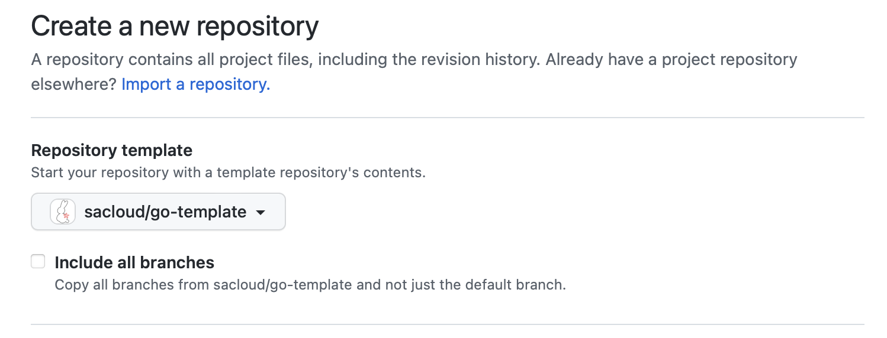

# sacloud/telemetry-go

[](https://pkg.go.dev/github.com/sacloud/telemetry-go)
[](https://github.com/sacloud/telemetry-go/actions/workflows/tests.yaml)
[](https://goreportcard.com/report/github.com/sacloud/telemetry-go)

さくらのクラウド向けOSSプロダクトでのプロジェクトテンプレート(Go)

## 概要

さくらのクラウド向けOSSプロダクトでGo言語を中心に用いるプロジェクトのためのテンプレート

## 使い方

GitHubでリポジトリを作成する際にテンプレートとしてsacloud/telemetry-goを選択して作成します。  


次に`telemetry-go`という文字列を自身のプロジェクトのものに置き換えてください。

例: exampleという名前のプロジェクトを作成する場合

```bash
# 作成したプロジェクトのディレクトリに移動
cd example
# 置き換え
find . -type f | xargs sed -i '' -e "s/telemetry-go/example/g"
```

### DockerイメージをGitHub Container Registryで公開する際の注意点

デフォルトでは`CR_PAT`が渡されないためGitHub Actionsでのイメージのビルド/プッシュに失敗します。
また、パッケージを公開したい場合は初回のみ手作業が必要です。

このためDockerイメージをGitHub Container Registryで公開したい場合はオーガニゼーション管理者にご相談ください。

## License

`telemetry-go` Copyright (C) 2022-2023 The sacloud/telemetry-go authors.
This project is published under [Apache 2.0 License](LICENSE).